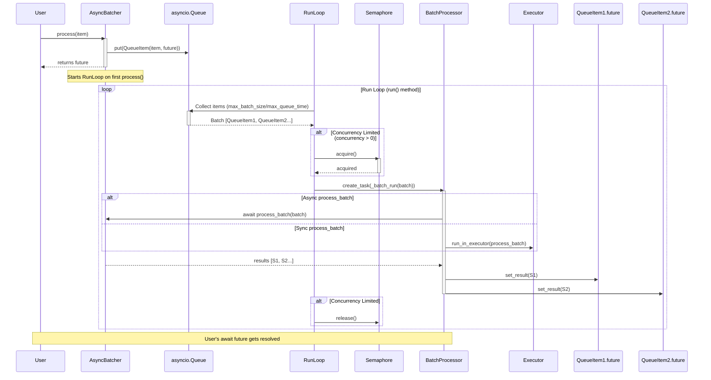

# AsyncBatcher - Asynchronous Batching for Python

## Overview
AsyncBatcher is a generic, asynchronous batch processor for Python that efficiently groups incoming items into batches
and processes them asynchronously. It is designed for scenarios where multiple requests or tasks need to be handled in
batches to improve efficiency and throughput.

## Key Features
- Asynchronous processing: Uses asyncio for non-blocking execution.
- Batching mechanism: Groups items into batches based on size or time constraints.
- Concurrency control: Limits the number of concurrent batch executions.
- Custom processing logic: Users must implement the `process_batch` method to define batch behavior.
- Queue management: Uses an `asyncio.Queue` to manage incoming items.
- Error handling: Ensures robust error reporting and handling.

## How it works

### 1. Receiving Items for Processing
- Users call `process(item)`, which adds the item to an internal queue.
- A `Future` object is returned immediately and the result is awaited asynchronously.

### 2. Queue Management and Batching
- A background task (`run()`) continuously monitors the queue.
- Items are collected into batches based on:
  - `max_batch_size`: Maximum items per batch.
  - `max_queue_time`: Maximum time an item can wait before being processed.
- Once a batch is ready, it is passed to the processing function.

### 3. Processing the Batch
- If `process_batch` is asynchronous, it is awaited directly.
- If `process_batch` is synchronous, it runs inside an `Executor`.
- Each item’s future is resolved with the corresponding processed result.

### 4. Concurrency Control
- If `concurrency > 0`, a semaphore ensures that only a limited number of batches are processed simultaneously.
- Otherwise, all batches run concurrently.

### 5. Stopping the Batcher
- Calling `stop(force=True)` cancels all ongoing tasks.
- Calling `stop(force=False)` waits for pending items to be processed before shutting down.



## How to use

To use the library, you need to install the package in your environment. You can install the package using pip:

```bash
pip install async-batcher
```

Then, you can create a new `AsyncBatcher` class by implementing the `process_batch` method:

```python
import asyncio
import logging

from async_batcher.batcher import AsyncBatcher

class MyBatchProcessor(AsyncBatcher[int, int]):
    async def process_batch(self, batch: list[int]) -> list[int]:
        await asyncio.sleep(1)  # Simulate processing delay
        return [x * 2 for x in batch]  # Example: Doubling each item

async def main():
    batcher = MyBatchProcessor(max_batch_size=5, max_queue_time=2.0, concurrency=2)
    results = await asyncio.gather(*[batcher.process(i) for i in range(10)])
    print(results)  # Output: [0, 2, 4, 6, 8, 10, 12, 14, 16, 18]
    await batcher.stop()

# Set logging level to DEBUG if you want to see more details and understand the flow
logging.basicConfig(level=logging.DEBUG)
asyncio.run(main())
```

## Benchmark

The benchmark is available in the [BENCHMARK.md](https://github.com/hussein-awala/async-batcher/blob/main/BENCHMARK.md)
file.

## When to Use AsyncBatcher?
The AsyncBatcher library is ideal for applications that need to efficiently handle asynchronous requests in batches,
such as:

### Machine Learning Model Serving
- Batch-processing requests to optimize inference performance (e.g., TensorFlow, PyTorch, Scikit-learn).

### Database Bulk Operations
- Inserting multiple records in a single query to improve I/O efficiency and reduce costs (e.g., PostgreSQL, MySQL,
  AWS DynamoDB). 

### Messaging and Network Optimization
- Sending multiple messages in a single API call to reduce latency and costs (e.g., Kafka, RabbitMQ, AWS SQS, AWS SNS).

### Rate-Limited API Calls
- Aggregating requests to comply with API rate limits (e.g., GitHub API, Twitter API, OpenAI API).

## Final Notes
- Implement `process_batch` according to your needs.
- Ensure `max_batch_size` and `max_queue_time` are configured based on performance requirements.
- Handle exceptions inside `process_batch` to avoid failures affecting other tasks.